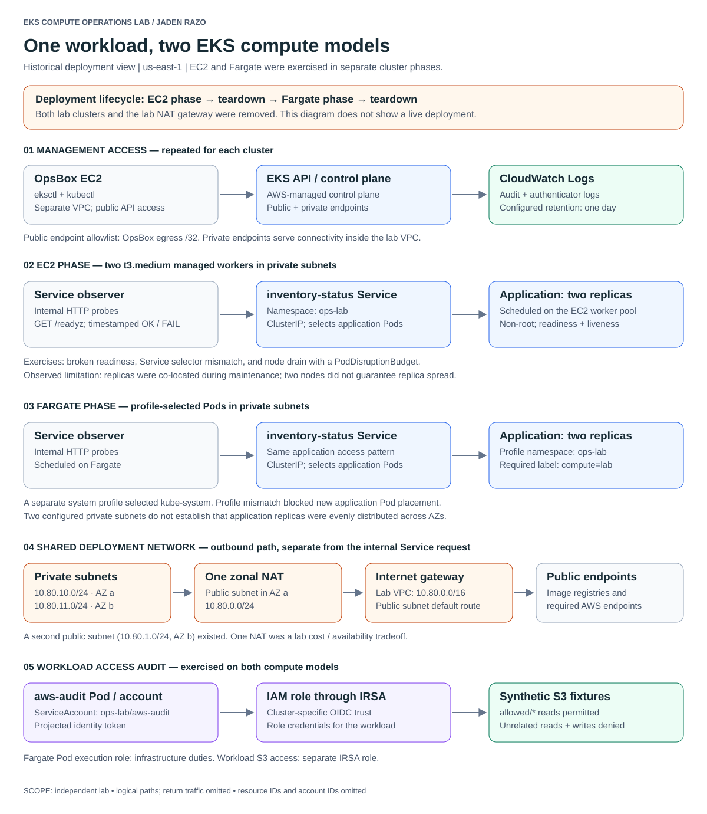
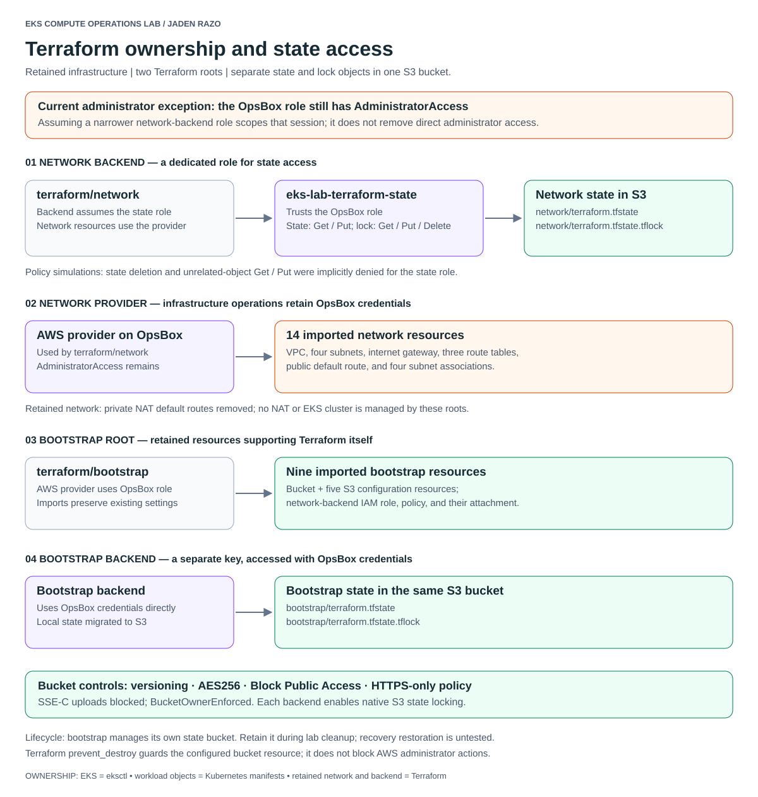

# EKS architecture diagrams

These diagrams describe an independent lab using the configuration and terminal evidence retained during the project. They are logical views, not live AWS inventory.

## Deployment phases



[Open the full-size diagram](eks-compute-architecture.svg) · [Mermaid topology sketch](eks-compute-architecture.mmd)

Read each numbered lane from left to right:

1. **Management:** the OpsBox uses the EKS public API endpoint. Each cluster also had private endpoint access enabled. EKS audit and authenticator logs were enabled in CloudWatch with one-day retention.
2. **EC2:** an observer sends HTTP requests through the application ClusterIP Service to eligible application Pods on a two-node managed worker pool. The service diagram is logical; it does not represent the Service as a separate proxy process. Pod placement changed during the exercises.
3. **Fargate:** the application uses the same Service request pattern, while profile selectors determine eligibility for Fargate placement. The applications profile selected `ops-lab` Pods with `compute=lab`; a separate profile selected `kube-system`.
4. **Egress:** private subnet default routes used a single NAT gateway in public subnet A and an internet gateway. This represents the deployed lab phase. The NAT and its private default routes were later removed. Internal Service requests do not travel through this NAT path.
5. **Workload identity:** the audit Pod's ServiceAccount token was used to obtain role credentials through STS. The workload then called S3 with those credentials. The arrow through the role represents authorization, not an IAM service proxying S3 traffic. Each cluster had its own OIDC trust configuration.

The EC2 and Fargate clusters were deployed sequentially and subsequently deleted. This map does not imply they ran concurrently. Subnets spanned two availability zones, but this does not establish balanced application placement. EC2 incident evidence explicitly shows replicas sharing a node.

The audit used synthetic S3 objects. The hardened workload policy allowed reads from `allowed/*`; observed checks denied an unrelated object read and an attempted write. The Fargate Pod execution role was separate from the workload's IRSA role.

## Terraform and state



[Open the full-size diagram](terraform-state-architecture.svg) · [Mermaid topology sketch](terraform-state-architecture.mmd)

- The network root tracks 14 imported network resources. Its backend assumes the dedicated state role. Its AWS provider still uses the OpsBox role.
- The bootstrap root tracks the bucket and five S3 configuration resources, plus the network-backend IAM role, policy, and attachment: nine resources in total.
- Network and bootstrap state have separate keys and lock objects in the same versioned S3 bucket. Bootstrap uses OpsBox credentials directly.
- State migration and subsequent no-change plans were completed. Bucket version restoration has not been exercised.
- The bootstrap root manages the bucket that holds its own state. The bucket is retained infrastructure. Terraform's `prevent_destroy` is not an AWS access-control boundary.
- The OpsBox role retains AdministratorAccess. Narrowing the network backend session does not remove that broader access. Simulation results describe the tested role policy, not every possible effective permission path.

## Edit and regenerate

`render.py` is the editable source for both diagrams. It uses only the Python standard library and produces SVGs plus Mermaid sketches from the same node and edge definitions.

From the repository root:

```bash
python3 diagrams/render.py
git diff -- diagrams
```

Edit labels in `compute()` or `state()`, regenerate, then inspect the SVG at full size. Keep labels within their boxes. The Mermaid sketches preserve the main relationships but omit some explanatory SVG annotations; they are not exact-layout sources for the SVGs.

The SVGs use a white canvas and system fonts, contain no external images or scripts, and omit AWS account IDs, resource IDs, public IPs, and bucket names. They are intended for GitHub embedding and the recorded walkthrough. Text remains selectable in the SVGs.

## Explain the design yourself

Before recording, practice answering:

1. Why can a rollout fail while requests to the Service continue succeeding?
2. Why does the internal request path not use the NAT gateway?
3. How do Fargate profile selectors differ from Service selectors?
4. Why are a Fargate execution role and a workload IRSA role separate?
5. Why does a scoped Terraform backend role not make an administrator-run provider least privilege?
6. What remains deployed after the lab clusters and NAT are deleted?

Each answer should connect the diagram to a manifest, policy, incident report, or saved result. Diagrams illustrate those records; they do not replace evidence.
